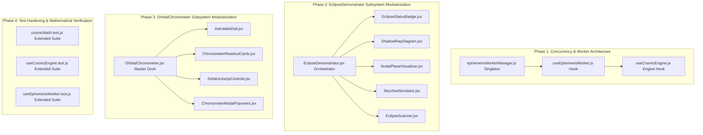

# Cosmic Engine V2.0 — Architectural Refactoring & Test Hardening Plan

**Role**: Principal Systems Architect  
**Objective**: High-level system design, state boundary definition, and multi-phase execution planning.

---

## Architecture Overview & System Map



---

## Phase 1: Concurrency Architecture & Ephemeris Worker Singleton [COMPLETED]

### 1. Objective & Goals
Resolve the Web Worker proliferation issue in [`src/hooks/useEphemerisWorker.js`](file:///c:/Users/konrk/OneDrive/Documents/ProgrammingProjects/Cosmic%20Engine%20V2.0/src/hooks/useEphemerisWorker.js) where each mounted dashboard window independently instantiates a dedicated Web Worker (`new Worker()`), creating up to 8 active workers. Implement an application-level singleton Web Worker manager (`ephemerisWorkerManager.js`) with request multiplexing and fallback detection, and refactor `useEphemerisWorker.js` to consume it.

### 2. Target File Paths
- `NEW`: [`src/workers/ephemerisWorkerManager.js`](file:///c:/Users/konrk/OneDrive/Documents/ProgrammingProjects/Cosmic%20Engine%20V2.0/src/workers/ephemerisWorkerManager.js)
- `MODIFY`: [`src/hooks/useEphemerisWorker.js`](file:///c:/Users/konrk/OneDrive/Documents/ProgrammingProjects/Cosmic%20Engine%20V2.0/src/hooks/useEphemerisWorker.js)
- `MODIFY`: [`src/hooks/useEphemerisWorker.test.js`](file:///c:/Users/konrk/OneDrive/Documents/ProgrammingProjects/Cosmic%20Engine%20V2.0/src/hooks/useEphemerisWorker.test.js)

### 3. Interface Signatures & Data Contracts

```typescript
// src/workers/ephemerisWorkerManager.js
export interface EphemerisCalculationParams {
  latitude: number;
  longitude: number;
  julianDate: number;
  timeOfDay: number;
  calculateLunar: boolean;
  calculateEclipse: boolean;
}

export interface EphemerisWorkerPayload {
  lunarEvents: LunarEvents | null;
  eclipse: EclipseData | null;
  timestamp: number;
}

export interface EphemerisWorkerManager {
  requestCalculation(params: EphemerisCalculationParams, onResult: (payload: EphemerisWorkerPayload) => void): () => void;
  isAvailable(): boolean;
  terminate(): void;
}

// src/hooks/useEphemerisWorker.js
export interface UseEphemerisWorkerParams {
  latitude: number;
  longitude: number;
  julianDate: number;
  timeOfDay: number;
  isLunarActive?: boolean;
  isEclipseActive?: boolean;
  isOrbitalActive?: boolean;
}

export interface UseEphemerisWorkerResult {
  lunarEvents: LunarEvents | null;
  eclipse: EclipseData | null;
  isWorkerActive: boolean;
}
```

### 4. Phase-by-Phase Task Checklist
- [x] Create `src/workers/ephemerisWorkerManager.js` implementing singleton lifecycle management, request ID tracking, message posting, error handling, and fallback detection.
- [x] Refactor `src/hooks/useEphemerisWorker.js` to subscribe to `ephemerisWorkerManager` instead of spawning per-component `Worker` instances inside `useEffect`.
- [x] Update `src/hooks/useEphemerisWorker.test.js` to verify singleton behavior, synchronous fallback when Worker is undefined, and request handling.

### 5. Verification & Acceptance Criteria
- Run `npm test -- src/hooks/useEphemerisWorker.test.js` — all tests pass.
- Switching between layout presets (Solar, Lunar, Master, Ultrawide) in `App.jsx` maintains exactly 1 worker instance without thread leakage.

---

## Phase 2: EclipseDemonstrator Decomposition & Subsystem Modularity [COMPLETED]

### 1. Objective & Goals
Deconstruct the monolithic 790-line `EclipseDemonstrator.jsx` widget into 5 focused sub-components under `src/components/widgets/eclipse/`. Isolate SVG shadow ray tracing (Live Orbit, Solar Focus, Lunar POV, Selenocentric), $5.14^\circ$ nodal plane alignment, sky view simulator, and historic/future eclipse scanner, while keeping `EclipseDemonstrator.jsx` as a lightweight orchestrator container (< 100 lines).

### 2. Target File Paths
- `NEW`: [`src/components/widgets/eclipse/EclipseStatusBadge.jsx`](file:///c:/Users/konrk/OneDrive/Documents/ProgrammingProjects/Cosmic%20Engine%20V2.0/src/components/widgets/eclipse/EclipseStatusBadge.jsx)
- `NEW`: [`src/components/widgets/eclipse/ShadowRayDiagram.jsx`](file:///c:/Users/konrk/OneDrive/Documents/ProgrammingProjects/Cosmic%20Engine%20V2.0/src/components/widgets/eclipse/ShadowRayDiagram.jsx)
- `NEW`: [`src/components/widgets/eclipse/NodalPlaneVisualizer.jsx`](file:///c:/Users/konrk/OneDrive/Documents/ProgrammingProjects/Cosmic%20Engine%20V2.0/src/components/widgets/eclipse/NodalPlaneVisualizer.jsx)
- `NEW`: [`src/components/widgets/eclipse/SkyViewSimulator.jsx`](file:///c:/Users/konrk/OneDrive/Documents/ProgrammingProjects/Cosmic%20Engine%20V2.0/src/components/widgets/eclipse/SkyViewSimulator.jsx)
- `NEW`: [`src/components/widgets/eclipse/EclipseScanner.jsx`](file:///c:/Users/konrk/OneDrive/Documents/ProgrammingProjects/Cosmic%20Engine%20V2.0/src/components/widgets/eclipse/EclipseScanner.jsx)
- `NEW`: [`src/components/widgets/eclipse/index.js`](file:///c:/Users/konrk/OneDrive/Documents/ProgrammingProjects/Cosmic%20Engine%20V2.0/src/components/widgets/eclipse/index.js)
- `MODIFY`: [`src/components/widgets/EclipseDemonstrator.jsx`](file:///c:/Users/konrk/OneDrive/Documents/ProgrammingProjects/Cosmic%20Engine%20V2.0/src/components/widgets/EclipseDemonstrator.jsx)

### 3. Interface Signatures & Data Contracts

```typescript
// Sub-component prop signatures:

export interface EclipseStatusBadgeProps {
  eclipse: EclipseData;
}

export interface ShadowRayDiagramProps {
  eclipse: EclipseData;
  diagramMode: 'live' | 'solar' | 'lunar';
  setDiagramMode: (mode: 'live' | 'solar' | 'lunar') => void;
  lunarViewSubTab: 'pov' | 'orbit';
  setLunarViewSubTab: (tab: 'pov' | 'orbit') => void;
}

export interface NodalPlaneVisualizerProps {
  eclipse: EclipseData;
}

export interface SkyViewSimulatorProps {
  eclipse: EclipseData;
}

export interface EclipseScannerProps {
  currentDate: Date;
  upcomingEclipses: Array<{
    date: Date;
    dayOffset: number;
    title: string;
    label: string;
    type: string;
    obscuration: number;
  }>;
  onSelectPreset: (presetDate: Date | string) => void;
}

export interface EclipseDemonstratorProps {
  currentDate?: Date;
  onDateChange?: (date: Date) => void;
  onTimeChange?: (time: number) => void;
  orbitalData?: { eclipse?: EclipseData };
}
```

```json
{
  "$schema": "https://json-schema.org/draft/2020-12/schema",
  "title": "EclipseData",
  "type": "object",
  "properties": {
    "type": { "type": "string", "enum": ["NONE", "TOTAL_SOLAR", "ANNULAR_SOLAR", "PARTIAL_SOLAR", "TOTAL_LUNAR", "PARTIAL_LUNAR", "PENUMBRAL_LUNAR"] },
    "category": { "type": "string", "enum": ["SOLAR", "LUNAR", "NO_ECLIPSE"] },
    "label": { "type": "string" },
    "obscuration": { "type": "number", "minimum": 0, "maximum": 100 },
    "beta": { "type": "number", "minimum": -5.14, "maximum": 5.14 },
    "nodeProximityDeg": { "type": "number", "minimum": 0, "maximum": 5.14 },
    "alignmentPercent": { "type": "number", "minimum": 0, "maximum": 100 },
    "isEclipseActive": { "type": "boolean" },
    "distanceKm": { "type": "number" },
    "umbraRadiusKm": { "type": "number" },
    "penumbraRadiusKm": { "type": "number" },
    "raDiff": { "type": "number", "minimum": 0, "maximum": 360 },
    "phaseValue": { "type": "number", "minimum": 0, "maximum": 1 }
  },
  "required": ["type", "category", "label", "obscuration", "beta", "nodeProximityDeg", "alignmentPercent", "isEclipseActive", "distanceKm", "raDiff", "phaseValue"]
}
```

### 4. Phase-by-Phase Task Checklist
- [x] Create `src/components/widgets/eclipse/EclipseStatusBadge.jsx` for rendering dynamic category status badge and node proximity gap.
- [x] Create `src/components/widgets/eclipse/ShadowRayDiagram.jsx` containing SVG gradients, geometry focus controls (Live Orbit, Solar Focus, Lunar POV/Orbit), ray tracing lines, umbra/penumbra cones, and real-time metric badges.
- [x] Create `src/components/widgets/eclipse/NodalPlaneVisualizer.jsx` containing $5.14^\circ$ tilted orbit line, ascending node $\ascnode$, $\pm 1.5^\circ$ corridor box, and alignment progress bar.
- [x] Create `src/components/widgets/eclipse/SkyViewSimulator.jsx` containing Earth-observer viewport with corona ray burst for Total Solar, ring of fire for Annular Solar, and Blood Moon glow for Total Lunar.
- [x] Create `src/components/widgets/eclipse/EclipseScanner.jsx` containing curated `ECLIPSE_PRESETS` grid and $+365$-day upcoming eclipse scanner list with date scrub triggers.
- [x] Create `src/components/widgets/eclipse/index.js` re-exporting all sub-components.
- [x] Refactor `src/components/widgets/EclipseDemonstrator.jsx` to assemble child components, reducing lines of code from 790 to under 100 lines while preserving 100% prop compatibility.

### 5. Verification & Acceptance Criteria
- Visual and functional 100% parity across all 4 tabs (`geometry`, `nodes`, `sky`, `scanner`) and sub-modes (`live`, `solar`, `lunar POV`, `selenocentric orbit`).
- `npm run build` succeeds with zero JSX/bundle errors.

---

## Phase 3: OrbitalChronometer Decomposition & Layout Dock Refactor [COMPLETED]

### 1. Objective & Goals
Deconstruct the monolithic 590-line `OrbitalChronometer.jsx` into 4 focused sub-components under `src/components/layout/chronometer/`. Modularize the 4-concentric interactive SVG astrolabe dial, direct entry input cards, solstice/equinox fast-jump buttons, and modal dialog popovers, reducing `OrbitalChronometer.jsx` to a clean container dock (< 100 lines).

### 2. Target File Paths
- `NEW`: [`src/components/layout/chronometer/AstrolabeDial.jsx`](file:///c:/Users/konrk/OneDrive/Documents/ProgrammingProjects/Cosmic%20Engine%20V2.0/src/components/layout/chronometer/AstrolabeDial.jsx)
- `NEW`: [`src/components/layout/chronometer/ChronometerReadoutCards.jsx`](file:///c:/Users/konrk/OneDrive/Documents/ProgrammingProjects/Cosmic%20Engine%20V2.0/src/components/layout/chronometer/ChronometerReadoutCards.jsx)
- `NEW`: [`src/components/layout/chronometer/SolsticeJumpControls.jsx`](file:///c:/Users/konrk/OneDrive/Documents/ProgrammingProjects/Cosmic%20Engine%20V2.0/src/components/layout/chronometer/SolsticeJumpControls.jsx)
- `NEW`: [`src/components/layout/chronometer/ChronometerModalPopovers.jsx`](file:///c:/Users/konrk/OneDrive/Documents/ProgrammingProjects/Cosmic%20Engine%20V2.0/src/components/layout/chronometer/ChronometerModalPopovers.jsx)
- `NEW`: [`src/components/layout/chronometer/index.js`](file:///c:/Users/konrk/OneDrive/Documents/ProgrammingProjects/Cosmic%20Engine%20V2.0/src/components/layout/chronometer/index.js)
- `MODIFY`: [`src/components/layout/OrbitalChronometer.jsx`](file:///c:/Users/konrk/OneDrive/Documents/ProgrammingProjects/Cosmic%20Engine%20V2.0/src/components/layout/OrbitalChronometer.jsx)

### 3. Interface Signatures & Data Contracts

```typescript
// Sub-component prop signatures:

export interface AstrolabeDialProps {
  date: Date;
  timeOfDay: number;
  latitude: number;
  longitude: number;
  declination: number;
  onDateChange: (date: Date) => void;
  onTimeChange: (time: number) => void;
  onLatChange: (lat: number) => void;
  onLonChange: (lon: number) => void;
}

export interface ChronometerReadoutCardsProps {
  latitude: number;
  longitude: number;
  timeOfDay: number;
  date: Date;
  onLatChange: (lat: number) => void;
  onLonChange: (lon: number) => void;
  onTimeChange: (time: number) => void;
  onDateChange: (date: Date) => void;
  onOpenPopup: (popup: 'lat' | 'lon') => void;
}

export interface SolsticeJumpControlsProps {
  currentTwilightPhase: string;
  date: Date;
  onDateChange: (date: Date) => void;
}

export interface ChronometerModalPopoversProps {
  activePopup: 'lat' | 'lon' | null;
  onClose: () => void;
  latitude: number;
  longitude: number;
  onLatChange: (lat: number) => void;
  onLonChange: (lon: number) => void;
}

export interface OrbitalChronometerProps {
  date: Date;
  onDateChange: (date: Date) => void;
  timeOfDay: number;
  onTimeChange: (time: number) => void;
  longitude: number;
  onLonChange: (lon: number) => void;
  latitude: number;
  onLatChange: (lat: number) => void;
  solarData?: { declination: number; sunrise: number; sunset: number; dayLength: number; solarNoon: number };
  isCollapsed?: boolean;
  onToggleCollapse?: () => void;
}
```

### 4. Phase-by-Phase Task Checklist
- [x] Create `src/components/layout/chronometer/AstrolabeDial.jsx` handling pointer dragging on concentric rings (Date, Time, Longitude, Latitude), coordinate math, year rollover detection, and `LivingMarble` center.
- [x] Create `src/components/layout/chronometer/ChronometerReadoutCards.jsx` containing direct input fields for Lat/Lon/Time/Date, `parseTimeString` validator, UTC "NOW" sync button, and modal trigger handlers.
- [x] Create `src/components/layout/chronometer/SolsticeJumpControls.jsx` rendering twilight phase status pill and fast-scrub buttons for March Equinox, June Solstice, September Equinox, and December Solstice.
- [x] Create `src/components/layout/chronometer/ChronometerModalPopovers.jsx` wrapping `LatitudeSlider` and `PolarLongitudeSelector` in backdrop-dismissible accessible modals.
- [x] Create `src/components/layout/chronometer/index.js` re-exporting all sub-components.
- [x] Refactor `src/components/layout/OrbitalChronometer.jsx` to assemble child components, reducing lines of code from 590 to under 100 lines while maintaining collapsed/expanded toggle support and 100% prop compatibility.

### 5. Verification & Acceptance Criteria
- Astrolabe 4-ring dial dragging, direct input typing, "NOW" sync button, solstice jumps, and latitude/longitude popup modals function identically.
- `npm run build` succeeds with zero JSX/bundle errors.

---

## Phase 4: Mathematical Test Suite Hardening (Polar Edge Cases & Syzygy Eclipse Math)

### 1. Objective & Goals
Significantly expand Vitest unit test suites in `src/utils/cosmicMath.test.js` and `src/hooks/useCosmicEngine.test.js` to rigorously test polar singularities ($\pm 90^\circ$ latitude, continuous twilight transitions at $\pm 65^\circ, \pm 70^\circ, \pm 78^\circ, \pm 85^\circ$), all 5 historic/future eclipse presets, node corridor thresholds ($\beta = 0^\circ, \pm 0.35^\circ, \pm 1.49^\circ, \pm 1.51^\circ$), Syzygy phase discriminator accuracy, and multi-year scanner recurrence.

### 2. Target File Paths
- `MODIFY`: [`src/utils/cosmicMath.test.js`](file:///c:/Users/konrk/OneDrive/Documents/ProgrammingProjects/Cosmic%20Engine%20V2.0/src/utils/cosmicMath.test.js)
- `MODIFY`: [`src/hooks/useCosmicEngine.test.js`](file:///c:/Users/konrk/OneDrive/Documents/ProgrammingProjects/Cosmic%20Engine%20V2.0/src/hooks/useCosmicEngine.test.js)

### 3. Interface Signatures & Test Matrix Specifications

```typescript
// Test suites coverage matrix:
// 1. Eclipse Presets & Syzygy Solver Matrix:
//    - April 8, 2024 Total Solar Eclipse (JD: 2460409.26) -> category: 'SOLAR', type: 'TOTAL_SOLAR', obscuration >= 98%
//    - October 2, 2024 Annular Solar Eclipse (JD: 2460586.28) -> category: 'SOLAR', type: 'ANNULAR_SOLAR', obscuration >= 90%
//    - March 14, 2025 Total Lunar Eclipse (JD: 2460748.79) -> category: 'LUNAR', type: 'TOTAL_LUNAR', obscuration == 100%
//    - August 12, 2026 European Total Eclipse (JD: 2461265.24) -> category: 'SOLAR', type: 'TOTAL_SOLAR', obscuration >= 95%
//    - August 2, 2027 Luxor Total Eclipse (JD: 2461619.92) -> category: 'SOLAR', type: 'TOTAL_SOLAR', obscuration >= 98%
//
// 2. Node Alignment Thresholds Matrix:
//    - beta = 0.00° -> alignmentPercent: 100%, isEclipseActive: true (at Syzygy)
//    - beta = 0.34° -> type: TOTAL_SOLAR (when distanceKm < 378000)
//    - beta = 1.49° -> isEclipseActive: true, category: 'SOLAR'
//    - beta = 1.51° -> isEclipseActive: false (outside 1.5° corridor)
//    - beta = 5.14° -> alignmentPercent: 0%, isEclipseActive: false
//
// 3. Polar Twilight & Boundary Singularity Matrix:
//    - lat: +90° & -90° -> No NaN in solarNoon, declination, dayLength, or twilight bands
//    - lat: +78° (Svalbard) in Nov/Dec -> PERPETUAL_TWILIGHT or PERPETUAL_NIGHT
//    - lat: -78° (McMurdo) in Dec -> PERPETUAL_DAY (24h sunlight)
```

### 4. Phase-by-Phase Task Checklist
- [ ] Add unit test suite in `cosmicMath.test.js` verifying all 5 presets in `ECLIPSE_PRESETS` (Apr 8 2024, Oct 2 2024, Mar 14 2025, Aug 12 2026, Aug 2 2027).
- [ ] Add unit test suite in `cosmicMath.test.js` for eclipse corridor boundary conditions ($\beta = 0^\circ, \pm 0.35^\circ, \pm 1.1^\circ, \pm 1.49^\circ, \pm 1.51^\circ, \pm 5.14^\circ$).
- [ ] Add unit test suite in `cosmicMath.test.js` for `findUpcomingEclipses` recurrence across 365 days.
- [ ] Add unit test suite in `cosmicMath.test.js` for polar twilight transitions and seasonal inversion across North/South Hemispheres.
- [ ] Add unit test suite in `useCosmicEngine.test.js` for degenerate longitude at poles ($90^\circ\text{N}, -90^\circ\text{S}$) ensuring no NaN propagation.
- [ ] Add unit test suite for time string parsing covering format variations (`"14:30"`, `"1430"`, `"930"`, `"14.5"`, invalid inputs).

### 5. Verification & Acceptance Criteria
- `npm test -- --run` executes and passes all test files (cosmicMath, hooks, store, workers) with 0 failures and >50 total test assertions.
- Total test count increases from 32 to 50+ passing unit tests.
- `npm run build` completes cleanly.
