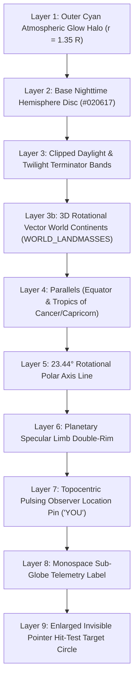

# ADR 0005: Reusable `<MiniGlobe />` Multi-Mode Projection Architecture & Analytical Subsolar Limb Clipping

## Status
Accepted

## Context
Across **Cosmic Engine V2.0**, Earth is rendered in multiple contexts requiring both scientific fidelity and aesthetic coherence:
1. **Heliocentric Macro Orbit View**: Earth orbiting on a Keplerian ellipse with illuminated sunward semicircle and $23.44^\circ$ projected axial obliquity.
2. **Eclipse Syzygy Profile (Left Pane)**: Side-on transverse ecliptic view displaying Earth's axial tilt chord, equator parallel, day/night division, and ray-traced Umbra/Penumbra syzygy shadow cones.
3. **Eclipse Nodal Sightline (Right Pane)**: Down-the-barrel view along the Sun-Earth axis through Earth, displaying projected axial tilt, equator chord, and rotating observer pin.
4. **Gyro-Morph Dynamic Armillary Sphere**: 3D Celestial Armillary sphere where Earth sits at the center, rotating dynamically with observer 3D Euler camera angles $(\psi, \theta, \phi)$ and displaying physical twilight bands.
5. **Astrolabe 2D Plates (Rete, Rojas, Horizon)**: 2D planispheric plates where Earth collapses into a stylized historical brass sighting pin.
6. **Gravitational Micro-Tide View**: Micro-scale Earth displaying rotating continents, day/night terminator, and syzygy ocean tidal wave oscillators.

Prior to `<MiniGlobe />`, individual components implemented divergent, ad-hoc SVG drawings (flat circles, hard-coded 2D arcs, or static beads), leading to visual disconnects, duplicate coordinate logic, and backside polygon tearing when computing day/night terminators on 3D spheres.

## Decision

Establish a single, reusable, highly optimized SVG component: `<MiniGlobe />` ([`src/components/common/MiniGlobe.tsx`](../../src/components/common/MiniGlobe.tsx)).

### 1. Unified 9-Layer SVG Rendering Pipeline
The component renders Earth using an explicit 9-layer SVG stacking architecture, ensuring zero z-index conflicts and DOM collision safety via React 19's `useId()` clip paths:

1. **Layer 1 (Atmospheric Glow Halo)**: Cyan radial gradient (`#38bdf8` $\to$ `#0369a1` $\to$ transparent) extending to $1.35\times$ radius, providing volumetric depth.
2. **Layer 2 (Nighttime Base Disc)**: Solid deep slate base circle (`#020617`) defining the unilluminated planetary sphere.
3. **Layer 3 (Daylight & Twilight Bands)**: Clipped daylight core radial gradient (`#60a5fa` $\to$ `#1d4ed8`), flanked by optional Nautical ($-12^\circ$, `#1e293b`) and Civil ($-6^\circ$, `#1e40af`) twilight bands generated via analytical spherical limb intersection.
4. **Layer 3b (Living Marble Continents)**: 3D rotational vector polygons (`WORLD_LANDMASSES`) rotated by observer Local Mean Solar Time (time of day) and Earth axial obliquity $\varepsilon = 23.439^\circ$, clipped to the visible front hemisphere ($z \ge 0$).
5. **Layer 4 (Parallels)**: Dashed cyan Equator ($0^\circ$, `#38bdf8`) and slate Tropics of Cancer ($+23.44^\circ$) and Capricorn ($-23.44^\circ$, `#64748b`).
6. **Layer 5 (Polar Axis)**: $23.44^\circ$ Rotational polar axis stroke (`#93c5fd`, dashed `2.5 1.5`).
7. **Layer 6 (Specular Limb Rim)**: Concentric hairline outer ($1.2\text{px}$, `#60a5fa`) and inner ($0.4\text{px}$, `#93c5fd`) strokes preserving a crisp planetary boundary across all zoom levels.
8. **Layer 7 (Topocentric Observer Pin)**: Pulsing cyan observer location pin ("YOU") at geographic $(\phi, \lambda)$ reporting real-time local daylight status (pulsing `#38bdf8` in daylight, muted `#64748b` in night).
9. **Layer 8 (Label)**: Optional monospace bold uppercase identifier (`label="EARTH"`).
10. **Layer 9 (Hit Target)**: Transparent circle ($r = \max(16, 1.6 R)$) providing stable mouse/touch pointer interactions without jitter.

---

### 2. Analytical Spherical Limb Clipping Algorithm
When rendering a sphere under arbitrary 3D Euler angles or solar illumination vectors $\vec{s} = (s_x, s_y, s_z)$, naive polygon slicing causes triangular backside tearing or chord-cutting near the planetary limb ($x^2 + y^2 = R^2$).

`<MiniGlobe />` implements a closed-form analytical solution (`generateAnalyticalLimbPath`) for any twilight threshold angle $h_0 \in [0^\circ, -6^\circ, -12^\circ, -18^\circ]$:

#### Basis Construction:
Let $s_\perp = \sqrt{s_x^2 + s_y^2}$. We construct an orthonormal basis $(\hat{u}, \hat{v})$ in the camera projection plane:
\[
\hat{u} = \left(-\frac{s_y}{s_\perp}, \; \frac{s_x}{s_\perp}\right), \quad \hat{v} = \left(-\frac{s_x s_z}{s_\perp}, \; -\frac{s_y s_z}{s_\perp}\right)
\]

#### Analytical Tangent Parameter ($\mu$):
The intersection between the great/small illumination circle at solar elevation $h_0$ and the visual limb horizon ($z_{\text{cam}} = 0$) is governed by the scalar parameter:
\[
\mu = \frac{-\sin h_0 \cdot s_z}{\cos h_0 \cdot \sqrt{s_x^2 + s_y^2}}
\]

#### Topological Cases:
1. **Backside Non-Intersection ($\mu \ge 1$)**:
   - If $s_z \ge \sin h_0$: The entire visible front hemisphere is illuminated (polar midnight sun / full daylight disc).
   - If $s_z < \sin h_0$: The circle is entirely on the obscured backside; zero daylight visible on the front disc.
2. **Front-Hemisphere Complete Circle ($\mu \le -1$)**:
   - The entire twilight/terminator circle lies entirely within the visible front hemisphere disc without intersecting the limb. Evaluated as a full 48-sample parametric SVG path with `evenodd` annular cutout, preventing backside tearing.
3. **Limb Intersection ($|\mu| < 1$)**:
   - The terminator intersects the limb boundary at exactly two antipodal angular coordinates:
     \[
     \phi_0 = \arcsin\mu, \quad \phi_{\text{start}} = \phi_0, \quad \phi_{\text{end}} = \pi - \phi_0
     \]
   - The illuminated front contour is traced parametrically through 36 angular steps from $\phi_{\text{start}}$ to $\phi_{\text{end}}$, and closed along the circular limb arc between $\theta_{\text{end}}$ and $\theta_{\text{start}}$, producing an exact, leak-free SVG path $d$.

---

### 3. Canonical 5-Mode Viewport Projections
`<MiniGlobe />` supports 5 canonical projection view modes matching the observatory visualizer subsystems:

| Mode | Coordinate Frame | Illumination Vector $\vec{s}$ | Equatorial / Axial Geometry |
| :--- | :--- | :--- | :--- |
| **`topdown`** | Heliocentric Ecliptic plane $(X, Y)$ viewed from $+Z$ | Sunward angle $\theta_\odot = \lambda_\odot + 180^\circ$ | Equator projected as ellipse $r_y = R \sin\varepsilon$, Tropics shifted by $\pm R \sin\varepsilon \cos\varepsilon$, Polar axis vertical along $Y$. |
| **`transverse`** | Geocentric transverse ecliptic side profile | Sun positioned at $-X$ ($\vec{s} = (-1, 0, 0)$) | Axial tilt rotated by $\varepsilon = 23.44^\circ$ in screen plane. Equator chord inclined by $90^\circ - \varepsilon$. |
| **`axial`** | Geocentric down-the-barrel Sun-Earth sightline | Sun positioned directly behind observer ($\vec{s} = (0, 0, -1)$) | Axial tilt rotated by projected solar obliquity $\theta_{\text{tilt}} = \arctan(\tan\varepsilon \cos\lambda_\odot)$. Equator drawn as elliptical arc. |
| **`euler3d`** | Free 3D Euler camera $(\text{Pitch } \psi, \text{Yaw } \theta, \text{Roll } \phi)$ | Arbitrary subsolar vector $\vec{s}_{\text{cam}} = \mathbf{R}_{\text{cam}} \vec{s}_{\text{eq}}$ | Rotates polar axis, Equator ellipse, and continents via full $3 \times 3$ Euler rotation matrix. |
| **`flat`** | 2D planispheric plate pin | Purely decorative / astrolabe alignment | Flat double-ring brass sighting pin (`#b45309`, `#78350f`) with centered pulsating cyan bead. |

---

## Consequences

### Positive
- **Architectural Unification**: A single tested component serves 5 distinct visualizer subsystems, eliminating $>600$ lines of duplicated SVG rendering code.
- **Zero Backside Tearing**: Closed-form analytical $\mu$ limb intersection guarantees that daylight and twilight curves never produce self-intersecting loops, NaN arc segments, or polygon edge artifacts.
- **Collision-Safe SVG Resources**: All gradients and clip-paths use React 19 `useId()` tokens, preventing cross-component gradient bleeding when multiple MiniGlobes are visible on screen simultaneously (e.g. Eclipse Demonstrator side-by-side view).
- **Physical Authenticity**: Real-time rotating continents, topocentric observer daylight status, and physical $23.439^\circ$ axial tilt provide consistent astronomical accuracy.

### Invariants
- When rendering `<MiniGlobe />` in 3D modes, never bypass `generateAnalyticalLimbPath` with ad-hoc straight line chords.
- Always provide valid geographic observer coordinates (`latitude`, `longitude`, `timeOfDay`) to maintain synchronized diurnal rotation across views.
